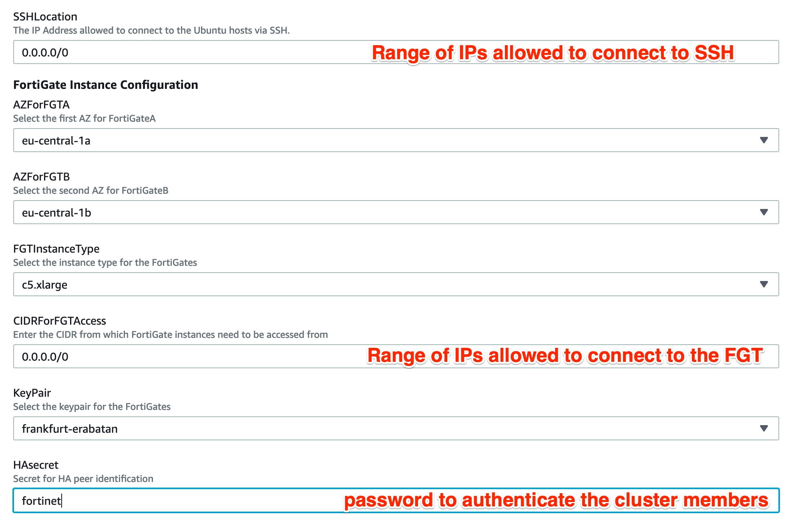
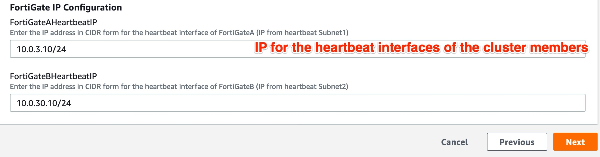

# AWS Transit Gateway flows secured by a pair of Active/Passive Fortigate running High Availability 

## Introduction

When enterprises have their resources spread over the cloud, they often use segmentation as a first step into their journey dedicated to security. In AWS it usually means their network architecture will involve a Transit Gateway (TGW).
This project gives an example of the usage of the recently (November 2018) announced [AWS Transit Gateway](https://aws.amazon.com/transit-gateway/) product. That component provides a way to interconnect multiple VPCs in a hub-spoke topology.

The Transit Gateway is meant to supersede the more complex and expensive Transit VPC technology. This is a didactic example to showcase how a Transit VPC should be configured to achieve a non-trivial (full mesh) scenario.

# Design

In AWS you can create a hub and spoke architecture using a Transit Gateway object, interconnecting some selected VPCs. Fortinet proposes to add one more VPC (called Security VPC) where all the security organs will be located to secure all the traffic flowing through. The TGW is configured to route all the communication flows between VPCs (called east<->west traffic) or between VPCs and outside (called South->North or North->South traffic) to the security organs which will clean them seamlessly.

TGW can be attached to the security VPC using VPNs attachments or standard attachements. As VPN attachments introduce limitations such as [performance limitations] (https://aws.amazon.com/vpn/faqs/?nc1=h_ls) or the usage of Source NAT, Fortinet has put efforts into developping an alternative solution. 

FortiOS now supports using FGCP (FortiGate Clustering Protocol) in unicast form to provide an active-passive clustering solution for deployments in AWS. This feature shares a majority of the functionality that FGCP on FortiGate hardware provides with key changes to support AWS SDN (Software Defined Networking).

Unlike the competition, FortiOS is able to select which part of the configuration file to sync between the HA members. In AWS, the subnets located in different zones do not share the same subnet IP ranges and gateways. Therefore the integrated solution must adapt to the zones, synchronizing only some of the objects selected by the administrator. 

This solution works with two FortiGate instances configured as a master and slave pair and that the instances are deployed in different subnets and different availability zones within a single VPC. These FortiGate instances act as a single logical instance and do not share interface IP addressing as they are in different subnets.

The pair of Fortigate will receive traffic from the TGW via a transit subnet. After cleaning the packets will be conveyed to their destination seanlessly. 

The main benefits of this solution are:

  - Fast and stateful failover of FortiOS and AWS SDN without external automation\services
  - Automatic AWS SDN updates to EIPs and route targets
  - Native FortiOS session sync of firewall, IPsec\SSL VPN, and VOIP sessions
  - Native FortiOS configuration sync
  - Ease of use as the cluster is treated as single logical FortiGate

The solution is considered as cloud native because it already embedds all the necessary API calls to adapt automatically the infrastructure to the network and security events. All the API calls are transparent to the user and do not need any manual configuration or intervention from the administrator. 

# How it works

East<->West traffic: When a VPC needs to communicate with another VPC, the packets are initiated from the client to its gateway. The local routing table fo the local VPC subnet will route the packets to the TGW via its attachement (depicted in orange in previous schema). As the subnet is associated to the orange routing table, the destination of the packets is checked against that routing table and the packets are forwarded to the security VPC via the referenced attachement link in red.
As step2, the packets are now forwarded to the security VPC either via zoneA or zoneB attached subnets. Both of them are associated to a local routing table forwarding all packets to the eni0 of the FortiGate master. This is step3.
The cluster is now receiving the packets on its unique data port then process them using all its security filters and modules (AV, IPS, AS, DLP, WAF, ... ). After cleaning, the solution uses its local default gateway to forward the packets to its local subnet gateway (see subnet in green associated to Routing Table 2). This is step4. Finally the routing table of the subnet forwards the packets to the TGW as step5 via the unique attachement between the security VPC and the TGW (depicted in red). 
The TGW has received the packets and checks the destination against the routing table the security VPC is associated to. As step6, the TGW can find the attachement2 as the logical link to reach the destination. 
** note: Return packets stricly follow the same path **

South->North / North->South: The first 4 steps are very similair to east-west traffic. At step5, the local routing table of the subnet can check the destination of the packets is not a VPC but an unknown range of IP (internet, on-remise, remote connection...) and uses its default route to forward the packets. The default route can be associated to an Internet Gateway (for internet), a NAT gateway or any other eni. As step5, the packets will be routed to external.

## How to deploy

The templates can deploy devices in PAYG (on demand) or BYOL (you provide the licence) models. You can select the appropriate template using the extension in the names. Ex: FGT_AP_HA_XAZ_newVPC_<extension>.template
  - BYOL: A demo license can be made available via your Fortinet partner or on our website. These can be injected during deployment or added after deployment. Purchased licenses need to be registered on the [Fortinet support site] (http://support.fortinet.com). Download the .lic file after registration. Note, these files may not work until 30 minutes after it's initial creation.
  - PAYG or OnDemand: These licenses are automatically generated during the deployment of the FortiGate systems.

The templates will deploy a solution containing the following components.
  - A Transit Gateway with 3 routing tables (associated to the VPC, associated to one management VPC, associated to the security VPC), all attachements and associations with the VPCs.
  - 2 FortiGate firewall's in an active/passive deployment
  - 1 security VPC with 8 subnets (1 relay subnet, 1 data subnet, 1 HA subnet and 1 management subnet x 2 zones) and 6 eni required for the FortiGate deployment (data, ha and management x 2 zones). 
  - 4 public IPs. The first public IP is for cluster access to/through the active FortiGate.  The other two PIPs are for Management access (Management access is used to make API calls to modify the infrastructure) and the last one is to get access to the bastion/mgmt device in VPCMGMT. From that device, you will be able to get access to the other devices located in other VPCs for testing purposes (Ex: to simulate east-west traffic). 

The FortiGate solution can be deployed using the AWS console in Services > CloudFormation. Fill up the form before to deploy the solution:

# Failover process

The slave member located in the security VPC is constantly monitoring the health of the master over the heartbeat link. As soon as it detects a failure, it automatically triggers an API call to the infrastructure to change the routes entries in the routing table of the attachement subnet (relay subnet) pointing to the new master (Ex-slave). 

# After deployment

1. login to Master unit:
From the AWS console Services > EC2, click on the FortigateA instance and retrieve its public IP and its instance ID. You can now connect to its GUI using the default login "admin" and the default password "<instance ID>". You will be prompted to change the password which will be synchronized to both units.

2. Give the HA cluster time to finish synchronizing their configuration and update files.  You can confirm that both the master and slave FortiGates are in sync by looking at the Synchronized column and confirming there is a green check next to both FortiGates. 
*** **Note:** Due to browser caching issues, the icon for Synchronization status may not update properly after the cluster is in-sync.  So either close your browser and log back into the cluster or alternatively verify the HA config sync status with the CLI command ‘get system ha status’. ***

3. You can connect to the bastion/management device located in the management VPC using ssh and your ssh key:
#ssh -i <path to your private key> ec2-user@<ip of the management device>

# Support
Fortinet-provided scripts in this and other GitHub projects do not fall under the regular Fortinet technical support scope and are not supported by FortiCare Support Services.
For direct issues, please refer to the [Issues](https://github.com/fortinet/fortigate-terraform-deploy/issues) tab of this GitHub project.
For other questions related to this project, contact [github@fortinet.com](mailto:github@fortinet.com).

## License
[License](https://github.com/fortinet/fortigate-terraform-deploy/blob/master/LICENSE) © Fortinet Technologies. All rights reserved.
