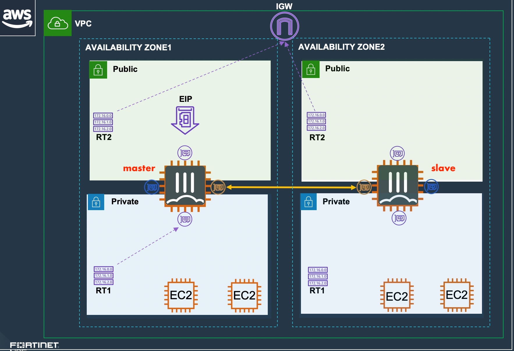
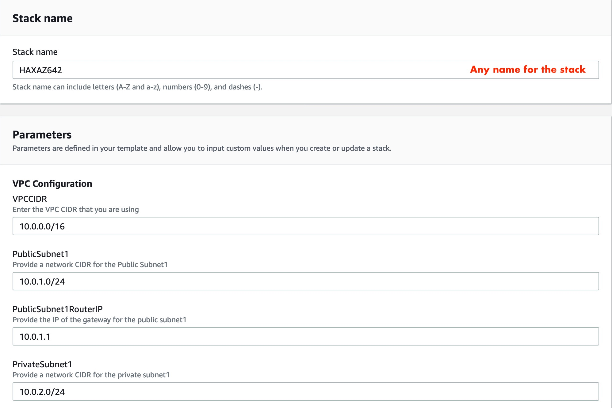
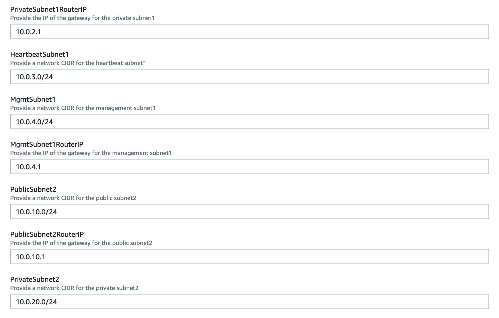
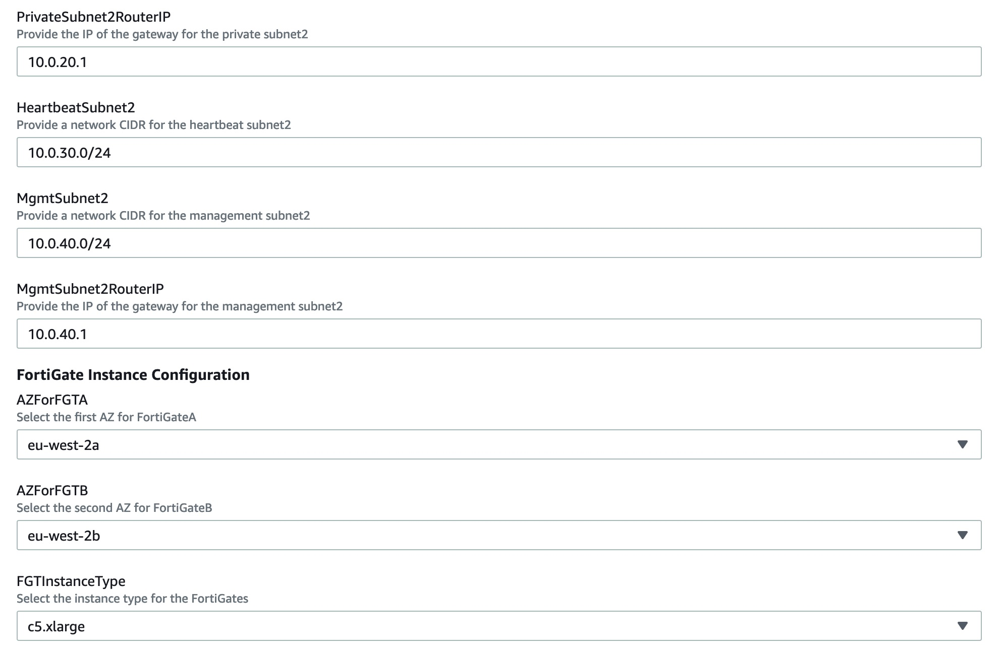
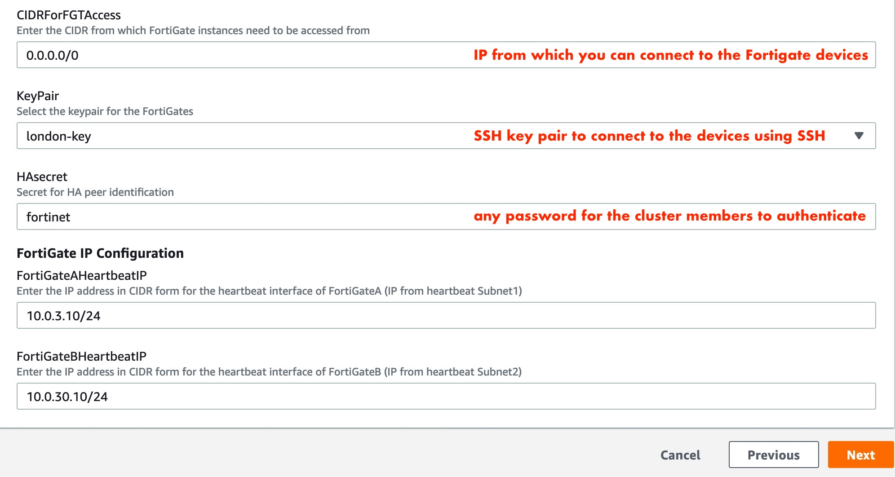
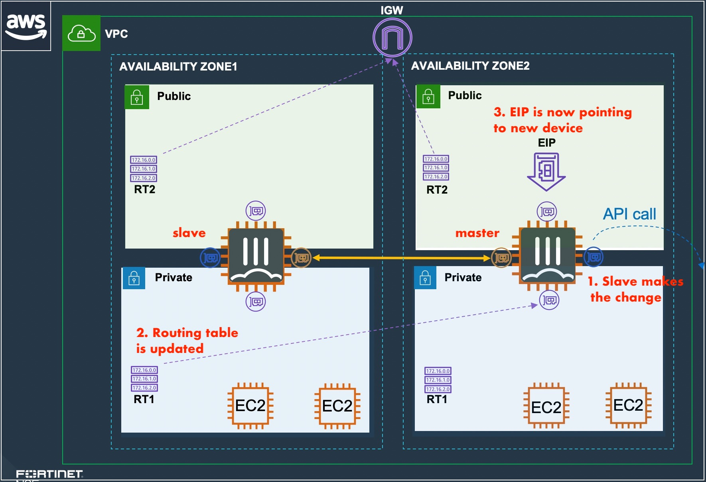

# Active/Passive FortiGate HA cluster Multi-AZ Deployment

| **FortiGate Deployment Templates** | **CloudFormation Template** | **1-Button Deployment** |
|-----------------|-----------------------------|-------------------------|
| **FortiGate Active/Passive FGCP Cluster (New VPC)**  *Creates a required infrastructure, and deploys a FortiGate Active/Passive FGCP cluster* | 

 |  |
| **FortiGate Active/Passive FGCP Cluster (Existing VPC)**  *Deploys a FortiGate-VM Active/Passive FGCP cluster into an existing VPC* | 

 |  |
||||

# Introduction

More and more enterprises are turning to AWS to extend internal data centers and take advantage of the elasticity of the public cloud. While AWS secures the access to the infrastructure, you are responsible for protecting everything you put in it. Fortinet Security Fabric provides AWS with the broad protection, native integration and automated management enabling customers with consistent enforcement and visibility across their multi-cloud infrastructure.
The solution adds layer7 security to AWS infrastructure. 

These CloudFormation templates deploy a High Availability pair of FortiGate Next-Generation Firewalls accompanied by the required infrastructure or integrating into it. Additionally, Fortinet Fabric Connectors deliver the ability to create dynamic security policies.

# Design

In AWS, you can deploy an active/passive pair of FortiGate VMs that communicate with each other through the infrastructure. This FortiGate setup will receive the traffic to be inspected using standard routing tables of the attached subnets and from the public IPs. You can send all or specific traffic that needs inspection, going to/coming from on-prem networks or public internet by adapting the local VPC routing.

These AWS CloudFormation templates can automatically deploy a full working environment or can integrate into your existing environment. These two behaviours are explicit in the names of the files (Ex: FGT_AP_HA_XAZ_<behaviour>_BYOL.template): 
- "existingVPC" means the template will prompt you for some parameters to best integrate the solution 
- "newVPC" means the template will create a new infrastructure to run the solution into. 

Licenses for Fortigate:

The templates can deploy devices in PAYG (on demand) or BYOL (you provide the licence) models. You can select the appropriate template using the extension in the names. Ex: FGT_AP_HA_XAZ_newVPC_<extension>.template
  - BYOL: A demo license can be made available via your Fortinet partner or on our website. These can be injected during deployment or added after deployment. Purchased licenses need to be registered on the [Fortinet support site] (http://support.fortinet.com). Download the .lic file after registration. Note, these files may not work until 30 minutes after it's initial creation.
  - PAYG or OnDemand: These licenses are automatically generated during the deployment of the FortiGate systems.

The templates will deploy a solution containing the following components.
  - 2 FortiGate firewall's in an active/passive deployment
  - (with newVPC behaviour) 1 VPC with 4 protected subnets (1 private, 1 Public in 2 zones) and 4 subnets required for the FortiGate deployment (ha and management in 2 zones). If using an existing VPC, it must already have 8 subnets
  - 3 public IPs. The first public IP is for cluster access to/through the active FortiGate.  The other two PIPs are for Management access (Management access is used to make API calls to modify the infrastructure).

# Concept of cloud native HA

FortiOS now supports using FGCP (FortiGate Clustering Protocol) in unicast form to provide an active-passive clustering solution for deployments in AWS. This feature shares a majority of the functionality that FGCP on FortiGate hardware provides with key changes to support AWS SDN (Software Defined Networking).

Unlike the competition, FortiOS is able to select which part of the configuration file to sync between the HA members. In AWS, the subnets located in different zones do not share the same subnet IP ranges and gateways. Therefore the integrated solution must adapt to the zones, synchronizing only some of the objects selected by the administrator. 

This solution works with two FortiGate instances configured as a master and slave pair and that the instances are deployed in different subnets and different availability zones within a single VPC. These FortiGate instances act as a single logical instance and do not share interface IP addressing as they are in different subnets.

The main benefits of this solution are:

  - Fast and stateful failover of FortiOS and AWS SDN without external automation\services
  - Automatic AWS SDN updates to EIPs and route targets
  - Native FortiOS session sync of firewall, IPsec\SSL VPN, and VOIP sessions
  - Native FortiOS configuration sync
  - Ease of use as the cluster is treated as single logical FortiGate

The solution is considered as cloud native because it already embedds all the necessary API calls to adapt automatically the infrastructure to the network and security events. All the API calls are transparent to the user and do not need any manual configuration or intervention from the administrator. 

FGCP HA provides AWS networks with enhanced reliability through device fail-over protection, link fail-over protection, and remote link fail-over protection. In addition, reliability is further enhanced with session fail-over protection for most IPv4 and IPv6 sessions including TCP, UDP, ICMP, IPsec\SSL VPN, and NAT sessions.
A FortiGate FGCP cluster appears as a single logical FortiGate instance and configuration synchronization allows you to configure a cluster in the same way as a standalone FortiGate unit. If a fail-over occurs, the cluster recovers quickly and automatically and can also send notifications to administrator so that the problem that caused the failure can be corrected and any failed resources restored.

The FortiGates are configured to use the unicast version of FGCP by applying the configuration below on both the master and slave FortiGate instances. This configuration is automatically configured and bootstrapped to the instances when deployed by the provided CloudFormation Templates.

- Number of ports and associated roles :

The FortiGate instances will use multiple interfaces for data plane and control plane traffic to achieve FGCP clustering in an AWS VPC. The FortiGate instances require four ENIs for this solution to work as designed so make sure to use an AWS EC2 instance type that supports this. Reference AWS Documentation for further information on this.

For data plane functions the FortiGates will use two dedicated ENIs, one for a public interface (ie ENI0\port1) and another for a private interface (ie ENI1\port2). These ENIs will utilize primary IP addressing and FortiOS will not sync the interface configuration (config system interface) or static routes (config router static) as these FGTs are in separate subnets. Thus when configuring these items, you should do so individually on both FortiGates.

A cluster EIP will be associated to the primary IP of the public interface (ie ENI0\port1) of the current master FortiGate instance and will be reassociated to a new master FortiGate instance as well.

For control plane functions, the FortiGates will use a dedicated ENI (ie ENI2\port3) for FGCP HA communication to perform tasks such as heartbeat checks, configuration sync, and session sync. A dedicated ENI is used as this is best practice for FGCP as it ensures the FortiGate instances have ample bandwidth for all critical HA communications.

The FortiGates will also use another dedicated ENI (ie ENI3\port4) for HA management access to each instance and also allow each instance to independently and directly communicate with the public AWS EC2 API. This dedicated interface is critical to failing over AWS SDN properly when a new FGCP HA master is elected and is the only method of access available to the current slave FortiGate instance.

# How it works:

The FortiGate instances will make calls to the public AWS EC2 API to update AWS SDN to failover both inbound and outbound traffic flows to the new master FortiGate instance. There are a few components that make this possible.

FortiOS will assume IAM permissions to access the AWS EC2 API by using the IAM instance role attached to the FortiGate instances. The instance role is what grants the required permissions for FortiOS to:

  - Reassign cluster EIPs assigned to primary IPs assigned to the data plane ENIs
  - Update existing routes to target the new master instance ENIs

The FortiGate instances will utilize their independent and direct internet access available through the FGCP HA management interface (ie ENI3\port4) to access the public AWS EC2 API. It is critical that this ENI is in a public subnet with an EIP assigned so that each instance has independent and direct access to the internet or the AWS SDN will not reference the current master FortiGate instance which will break data plane traffic.

For further information on FGCP reference the High Availability chapter in the FortiOS Handbook on the Fortinet Documentation site.

Note: Other Fortinet solutions for AWS such as FGCP HA (Single AZ), AutoScaling, and Transit Gateway are available. Please visit www.fortinet.com/aws for further information.

## How to deploy

The FortiGate solution can be deployed using the AWS console in Services > CloudFormation. Fill up the form before to deploy the solution:

# Failover process

The following network diagram will be used to illustrate a failover event from the current master FortiGate (FortiGate A), to the current slave FortiGate (FortiGate B).

Inbound failover is provided by reassigning the EIPs associated to the primary IP address of ENI0\port1 from FortiGate A's public interface to FortiGate B's public interface.

Outbound failover is provided updating any route targets referencing FortiGate A’s private interface reference FortiGate B’s private interface.

The AWS SDN is updated by FortiGate B initiating API calls from the dedicated HA management interface (ie ENI3\port4) through the AWS Internet Gateway.

# Requirements and limitations

Before attempting to create a stack with the templates, a few prerequisites should be checked to ensure a successful deployment:

  1. An AMI subscription must be active for the FortiGate license type being used in the template.

  * [BYOL Marketplace Listing](https://aws.amazon.com/marketplace/pp/B00ISG1GUG)
  * [PAYG Marketplace Listing](https://aws.amazon.com/marketplace/pp/B00PCZSWDA)

  2. The solution requires 3 EIPs to be created so ensure the AWS region being used has available capacity. Reference AWS Documentation for more information on EC2 resource limits and how to request increases.
  
  3. If BYOL licensing is to be used, ensure these licenses have been registered on the support site. Reference the VM license registration process PDF in this KB Article.
    
  4. Create a new S3 bucket in the same region where the template will be deployed. If the bucket is in a different region than the template deployment, bootstrapping will fail and the FGTs will be unaccessible.
    
  5. If BYOL licensing is to be used, upload these licenses to the root directory of the same S3 bucket from the step above.
  
  6. Ensure that an S3 gateway endpoint is deployed and assigned to both of the PublicSubnet's AWS route table. 
  * [Reference AWS Documentation] (https://docs.aws.amazon.com/vpc/latest/userguide/vpce-gateway.html#create-gateway-endpoint) for further information.
    
  7. Ensure that all of the PublicSubnet's and HAmgmtSubnet's AWS route tables have a default route to an AWS Internet Gateway. 
  * [Reference AWS Documentation] (https://docs.aws.amazon.com/vpc/latest/userguide/VPC_Route_Tables.html#route-tables-internet-gateway) for further information.

Once the prerequisites have been satisfied, login to your account in the AWS console and proceed with the deployment.

# After deployment

1. login to Master unit:
From the AWS console Services > EC2, click on the FortigateA instance and retrieve its public IP and its instance ID. You can now connect to its GUI using the default login "admin" and the default password "<instance ID>". You will be prompted to change the password which will be synchronized to both units.

2. Give the HA cluster time to finish synchronizing their configuration and update files.  You can confirm that both the master and slave FortiGates are in sync by looking at the Synchronized column and confirming there is a green check next to both FortiGates. 
*** **Note:** Due to browser caching issues, the icon for Synchronization status may not update properly after the cluster is in-sync.  So either close your browser and log back into the cluster or alternatively verify the HA config sync status with the CLI command ‘get system ha status’. ***

## Support
Fortinet-provided scripts in this and other GitHub projects do not fall under the regular Fortinet technical support scope and are not supported by FortiCare Support Services.
For direct issues, please refer to the [Issues](https://github.com/fortinet/aws-cloudformation-templates/issues) tab of this GitHub project.
For other questions related to this project, contact [github@fortinet.com](mailto:github@fortinet.com).

## License
[License](LICENSE) © Fortinet Technologies. All rights reserved.
