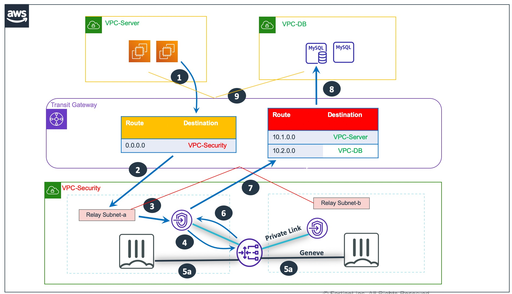
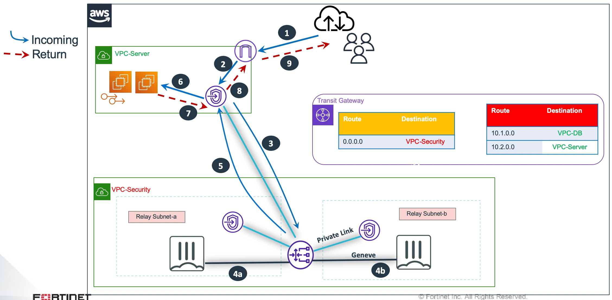
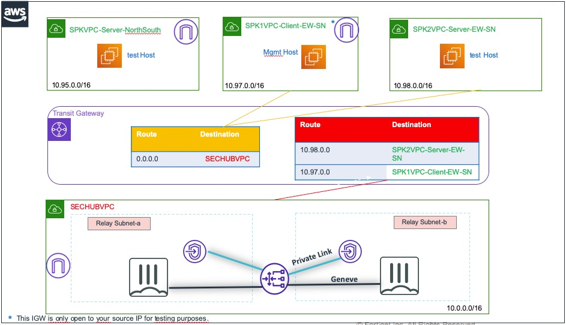
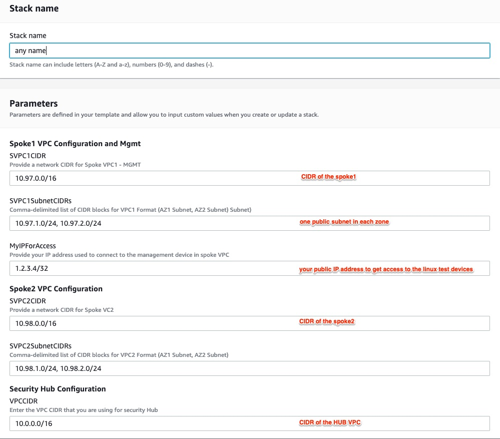
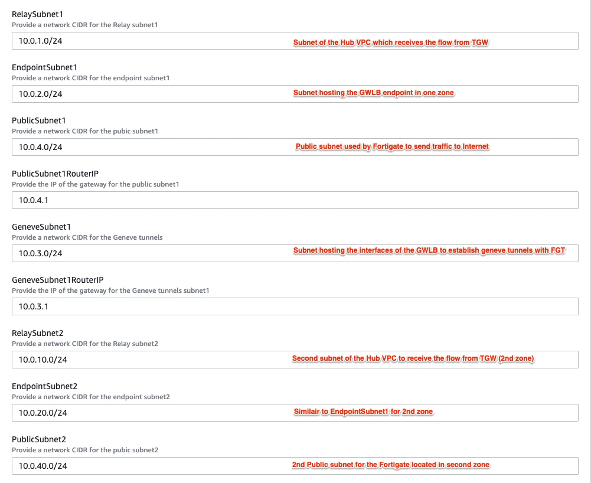
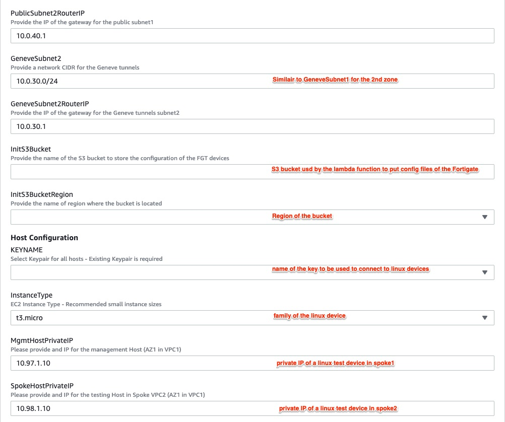
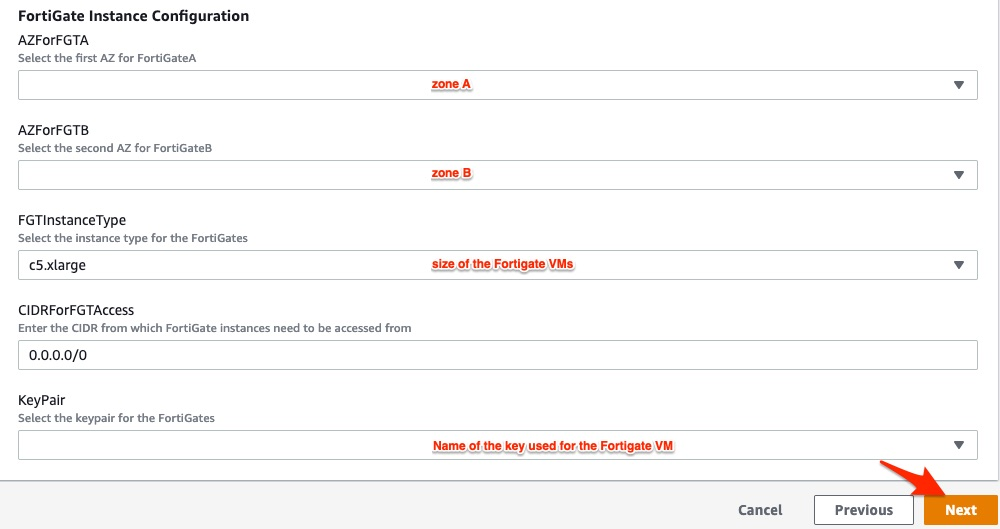

# Provide advanced L7 security to AWS TGW designs using FortiGate VM and AWS GWLB

## Introduction

When enterprises have their resources spread over the cloud, they often use segmentation as a first step into their journey dedicated to security. In AWS it usually means their network architecture will involve a Transit Gateway (TGW).

The Transit Gateway is meant to supersede the more complex and expensive Transit VPC technology. This is a didactic example to showcase how a Transit VPC should be configured to achieve a non-trivial (full mesh) scenario. It is the most useful EC2 component to achieve a hub and spoke architecture. 

Recently AWS released a new load balancer to facilitate the integration of security devices into hub and spokes designs. Using , stateful sessions can be distributed to security devices thus overcoming some limitations regarding to performance, routing or failover...  

### About GWLB

GWLB was released to help AWS :

 - Deploy 3rd party virtual appliances faster
 - Scale virtual appliances while managing costs
 - Improve virtual appliance reliability

It is made of three major components:

 **Gateway Load Balancer** – A load balancer that distributes session to targets that are connected to it via Geneve protocol in the subnets for which it is enabled. The GWLB will only be accessible from these subnets by the Fortigate appliance pool.

 **Target Group Eni** –  The Instance or IP (Fortigate) that acts as a Geneve target for the Gateway Load Balancer. A Fortigate is configured to establish a Geneve Encapsulation interface on this IP/Interface.

 **Gateway Load Balancer Endpoint (GWLBe)** – A destination in a route table that will forward the traffic over PrivateLink to the GWLB to be distributed to the Target Group.
(Note: GWLBe is a Zonal Construct. One is required in each Zone, with some exceptions)

As GWLB has been designed to take AWS zoning into consideration, the sessions will be preferably dispatched to targets located in the same zone as the origin of the traffic. This introduces a limitation with large architectures where sources and destinations may be located in different zones. 

TGW component may be used as a relay and stateful object to avoid assymetric flows when dealing with multi zones communications. It is a mandatory object to support advanced security for E-W traffic multi zones.

## Design

As GWLB was introduced to help seamless integration of third party security components into traditional hub and spokes architectures, Fortinet has put efforts to natively support geneve tunnels to connect to this component.

- All sessions initiated from AWS devices will be routed to TGW running in appliance mode (stateful) before they get forwarded to a GWLB endpoint. This extends privatelink based scenariis. GWLB then creates a session and serves traffic to one Fortigate component for L7 advanced security (IPS, AV, Application control, Web filtering, DLP, WAF...). After cleaning, traffic destined to an AWS VPC returns to GWLB via the same originating geneve tunnel and GWLB originating endpoint. This traffic will be routed back to TGW to reach out to its destination as the next hop. Traffic destined to internet is immediately routed by the Fortigate to the local IGW of the security VPC. 

- Ingress traffic initiated from Internet to a device located in a VPC must enter via its local IGW. Traffic is routed to local GWLB endpoint (located inside the VPC) before reaching out to the GWLB then a Fortigate device for inspection. Traffic is returned back to originating VPC via the endpoint and meets its destination.

The main benefits of this solution are:

  - Fast failover of FortiOS and AWS SDN without external automation\services
  - Enhanced scalability for high performance needs
  - stateful inspection
  - No need for source NATting for E-W communications  

## How it works

### East<->West traffic
When a VPC needs to communicate with another VPC, the packets are initiated from the client to its gateway. The local routing table fo the local VPC subnet will route the packets to the TGW via its attachement (depicted in orange as **step1**). As the subnet is associated to the orange routing table, the destination of the packets is checked against that routing table and the packets are forwarded to the security VPC via the referenced attachement link in red.
As **step2**, the packets are now forwarded to the security VPC either via zoneA or zoneB attached subnets. TGW is configured in appliance mode (i.e stateful mode) and will always route packets to the same zone for one established session. Both relay subnets are associated to a local routing table forwarding all packets to the GWLB endpoint interface located in the same local zone. This is **step3**.
The packets entering the endpoint are automatically forwarded to the local GWLB component responsible for establishing a tunnel to the local Fortigate device located in the zone. This is **step4**.
As **step5**, the local Fortigate device is now receiving the packets on its unique geneve tunnel interface and processes them using all its security filters and modules (AV, IPS, AS, DLP, WAF, ... ). If no Fortigate device is available in that zone, GWLB component is configured to forward traffic to another zone where another Fortigate device will be present. After cleaning, the solution uses its local routing table (pointing to all VPC CIDR) to forward the packets back to the tunnel. 
After the packets have reached out to the GWLB interface via the geneve tunnel, they are routed back to the originating endpoint subnet as described by **step6**. 
Endpoint subnet is associated to a routing table whose purpose is to route all traffic to TGW via the VPC attachment. Packets reach out to the TGW (**step7**) via the attachment (depicted in red) then hit the associated red routing table. 
TGW will route the packets to their final destination in the destination VPC as **step8**.

** note: Return packets stricly follow the same path **

### South->North traffic
When a VPC needs to communicate with another VPC, the packets are initiated from the client to its gateway. The local routing table fo the local VPC subnet will route the packets to the TGW via its attachement (depicted in orange as **step1**). As the subnet is associated to the orange routing table, the destination of the packets is checked against that routing table and the packets are forwarded to the security VPC via the referenced attachement link in red.
As **step2**, the packets are now forwarded to the security VPC either via zoneA or zoneB attached subnets. TGW is configured in appliance mode (i.e stateful mode) and will always route packets to the same zone for one established session. Both relay subnets are associated to a local routing table forwarding all packets to the GWLB endpoint interface located in the same local zone. This is **step3**.
The packets entering the endpoint are automatically forwarded to the local GWLB component responsible for establishing a tunnel to the local Fortigate device located in the zone. This is **step4**.
As **step5**, the local Fortigate device is now receiving the packets on its unique geneve tunnel interface and processes them using all its security filters and modules (AV, IPS, AS, DLP, WAF, ... ). If no Fortigate device is available in that zone, GWLB component is configured to forward traffic to another zone where another Fortigate device will be present. After cleaning, the solution uses its local routing table (pointing to the public subnet via port1) to send packet to public subnet's local router. The public subnet is configured with a default route pointing to the local IGW of the security VPC and routes packets to it as **step6**.
**Step7** is the final step as packets reach out to their destination on internet.

** note: Return packets stricly follow the same path ** 

### North->South
Ingress traffic is bit more challenging because GWLB can only initiate a session with a SYN packet entering the endpoint interface. Reverse direction (from target to GWLB interface) is not allowed. Therefore traffic must reach out to the GWLB before packets hit the targets. Bypassing the GWLB and using Fortigate as the destination of the ingress session would add some complexity in routing (especially for return packets). 

The recommended approach to reach a server is to use the local IGW of the VPC it is located in (**step1**). Ingress packets would hit the edge routing database of the VPC (i.e the routing table of the IGW) which forward them to a local GWLB endpoint (**step2**). The endpoint is responsible for sending packets directly to the GWLB as **step3** before they get dispatched to the target group of Fortigates (**step4**). The Fortigate will clean the sessions with advanced filtering and route the traffic back to the GWLB. 
As **step5**, the packets follow a path back to the GWLB endpoint located in the server VPC. The GWLB endpoint is located on a specific subnet whose routing table has a default route to the IGW and a local route to the VPC CIDR. It is responsible for routing the packets to their final destination as **step6**. 
Return traffic is nearly similair: after they are cleaned by the Fortigate device, packets coming back to the endpoint will use the default route instead of the local route installed on the endpoint subnet's local router. This local router located in the server VPC will route the packets to the source, located on internet (**step8 and step9**).

## How to deploy

The templates can deploy devices in PAYG (on demand) or BYOL (you provide the licence) models. You can select the appropriate template using the extension in the names. Ex: FGT-2AZ-GWLB_<extension>.yaml
  - BYOL: A demo license can be made available via your Fortinet partner or on our website. These can be injected during deployment or added after deployment. Purchased licenses need to be registered on the . Download the .lic file after registration. Note, these files may not work until 30 minutes after it's initial creation.
  - PAYG or OnDemand: These licenses are automatically generated during the deployment of the FortiGate systems.

The templates will deploy a solution containing the following components.
  - A Transit Gateway configured in appliance mode with 2 routing tables (associated to the VPCs, associated to the security VPC), all attachements and associations with the VPCs.
  - 1 security VPC with 8 subnets (1 relay subnet, 1 subnet hosting the GWLB endpoint, 1 subnet for the GWLB enis and 1 public subnet for the security devices x 2 zones) and 2 eni required for each FortiGate.
  - 1 GWLB located in the security VPC described above. It is configured with cross zones enabled.
  - 2 FortiGate firewall's in standalone mode already configured with geneve tunnels to the GWLB
  - 1 public IPs for each Fortigate device. 
  - 2 spokes VPC running a linux device to be used for testing (E-W & S-N traffic directions)

The Fortinet based infrastructure solution can be deployed using the AWS console in Services > CloudFormation. Fill up the form before to deploy the solution:

## Failover process

It is recommended to test failover with TCP/UDP protocols instead of ICMP.

## After deployment

1. You can easily test traffic directions connecting to the linux device using the following commands:
    ssh -i < path to your private key > ec2-user@< public ip of the linux device >
    ping <private ip of the linux device located in the other VPC>
    ping 8.8.8.8 => (test S-N traffic direction)

2. login to one of the two Fortigate unit:
From the AWS console Services > EC2, click on the Fortigate instance and retrieve its public IP and its instance ID. You can now connect to its GUI using the default login "admin" and the default password < instance ID >. You will be prompted to change the password.

## Support
Fortinet-provided scripts in this and other GitHub projects do not fall under the regular Fortinet technical support scope and are not supported by FortiCare Support Services.
For direct issues, please refer to the [Issues](https://github.com/fortinet/fortigate-terraform-deploy/issues) tab of this GitHub project.
For other questions related to this project, contact [github@fortinet.com](mailto:github@fortinet.com).

## License
[License](https://github.com/fortinet/fortigate-terraform-deploy/blob/master/LICENSE) © Fortinet Technologies. All rights reserved.
